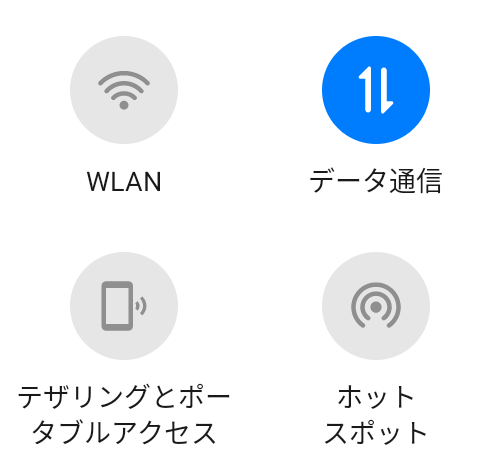
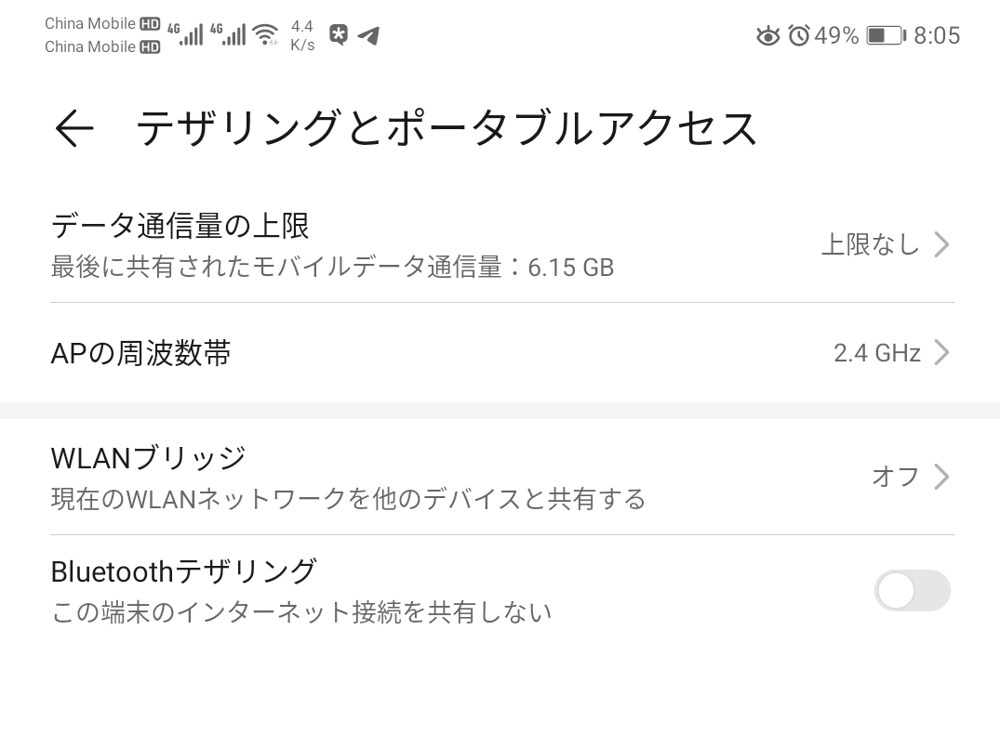

# WifiBridgeTile

+ Add `Tethering & portable hotspot` (`移动网络共享` `テザリングとポータブルアクセス`) to quick setting tiles
+ With `WLAN bridge` (`WLAN桥` `WLANブリッジ`) setting when supported (such as some type of HUAWEI)
> + Find activity classname in application [QuickShortcutMaker(ショートカットツール)](https://play.google.com/store/apps/details?id=com.sika524.android.quickshortcut)

### Shortcuts

|||
|:---:|:---:|
|Quick setting panel|Tethering and portable hotspot|
